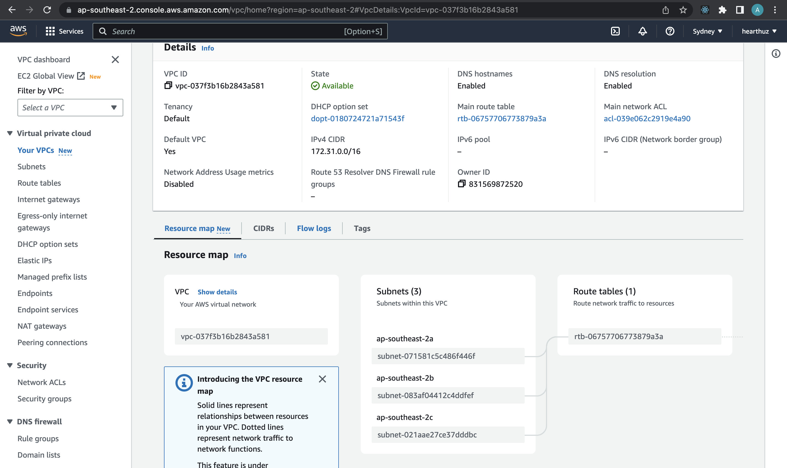
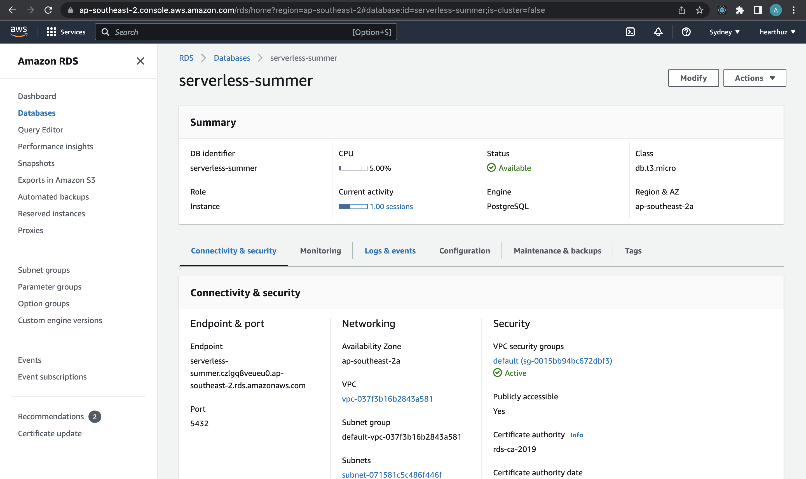
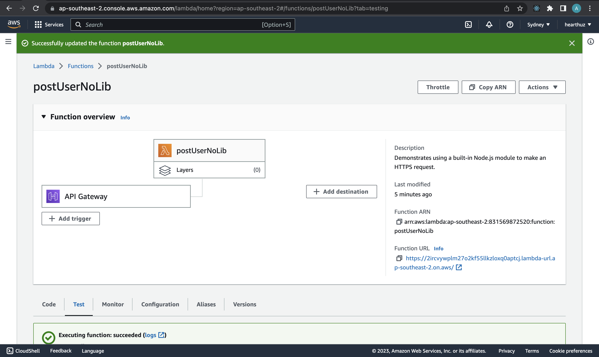
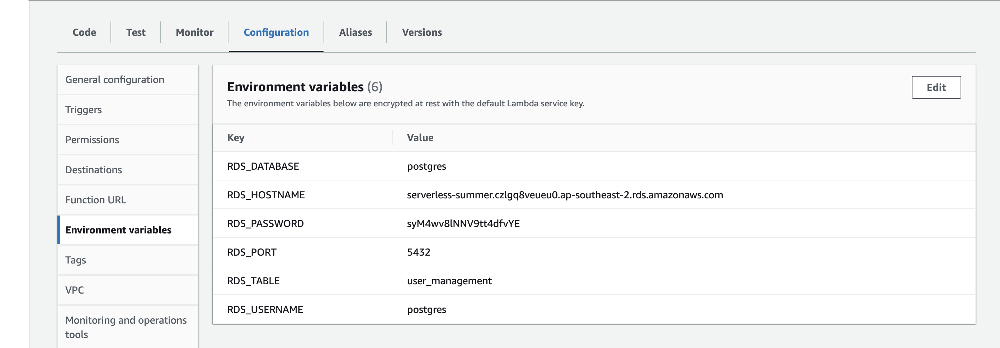

**Serverless Homework**

**Create a VPC**

- create a vpc to have subnet

**Create database in RDS**

- allow Publicly accessible
- connect VPC

**Create lambda in AWS**

- create and setting postgresql Database

- config env for lambda function to connect to RDS database

- 

- connect lambda with VPC

- create javascript repository to use in lambda function

- zip the repository using node-lambda

**Create API Gate Way**

- create post function
- connect to lambda function in aws

**Create security group**

- edit security group to expose to any ware
- using security group in subnet
